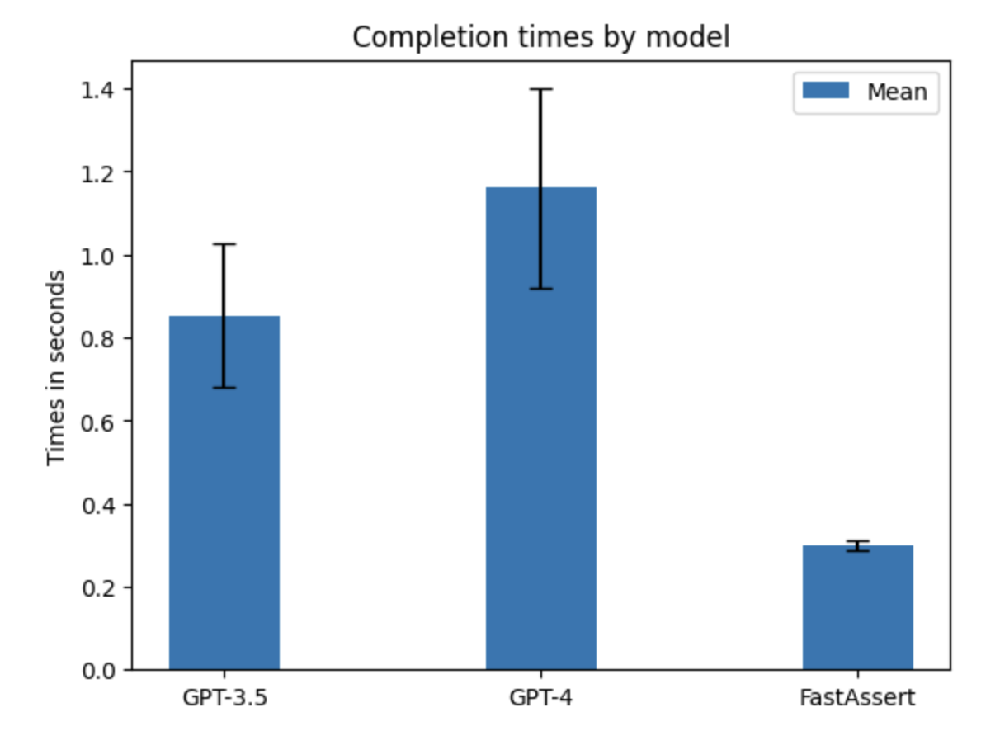

# FastAssert 

> **TL;DR :** FastAssert is a dockerized LLM inference server with constrained output (JSON models), built on top of vLLM. It’s faster, cheaper and doesn’t impact your LLM provider API rate limit. Get a script to compare the quality and latency compared to your current LLM API provider.

## What is FastAssert?

FastAssert is a dockerized LLM inference server with constrained output (JSON models). It's built on top of vLLM, the leading LLM inference server.

This means, with the same level of accuracy :

- improved latency (especially if you were using Function Calling)
- reduced cost (especially if you were using Function Calling)
- lower chance to hit the API rate limit of your LLM provider (OpenAI and family)
- no validation error : guaranteed JSON or regex output 

## Performance Overview

See the notebook `performance.ipynb` for a full analysis. For the OpenAI function calling demo task, FastAssert achieved the same level of accuracy that OpenAI GPT3.5 turbo with function calling while being 3x faster.



Accuracy on the task:
```
GPT3-5 turbo accuracy 0.7857
GPT4 accuracy 0.9285
FastAssert accuracy 0.7857
```

## How does it work?

FastAssert provides you with :

- a server to run locally, using vLLM, fastapi and outlines : takes a text prompt and a JSON format or regex expression as request, and returns the desired generation
- a notebook and script to assess the performance of the server in term of accuracy and latency compared to your current implementation and find the optimal model to use

## Common use cases

- Complex chaining : to enforce a given output JSON format
- Tool use : generate the tool parameters using the JSON output
- Intent Classification : check if the user input is a question, a command, a greeting, etc.
- Sentiment Analysis : detect angry or negative user input
- Detect forbiden content : NSFW, hate speech, violence, etc.
- Detect specific content : competitor mention, personal data, etc.
- And more!

## Requirements

- OS: Linux
- CUDA 12.1
- Min. GPU RAM for inference : 16 GB (we used a NVIDIA A100 40GB)

## Installation

### Server

Build the container:
```shell
sudo docker build -t fastassert .
```

Run the container:
```shell
sudo docker run --gpus all -p 8000:8000 fastassert
```

Your server is now running on port 8000

You can call it through a OpenAI compatile API with a prompt and a JSON schema:
```
curl http://127.0.0.1:8000/generate \
    -d '{
        "prompt": "What is the capital of France?",
        "schema": {"type": "string", "maxLength": 5}
        }'
```
or a regex:
```
curl http://127.0.0.1:8000/generate \
    -d '{
        "prompt": "What is Pi? Give me the first 15 digits: ",
        "regex": "(-)?(0|[1-9][0-9]*)(\\.[0-9]+)?([eE][+-][0-9]+)?"
        }'
```

### Notebook

Install the required dependancies to run a Jupyter Notebook 
```
conda create --name notebookenv python=3.11
conda activate notebookenv
conda install ipykernel
python -m ipykernel install --user --name=notebookenv --display-name="Python (notebookenv)"
conda install notebook
```

(Optional) Add a password to secure your notebook
```
jupyter notebook password
```

If you want to compare the performance of the FastAssert server to your current OpenAI implementation, don't forget to export your API key as an environment variable before starting the jupyter notebook:
```
export OPENAI_API_KEY=""
```

Launch the notebook in remote access mode in the remote machine:
```
jupyter notebook --no-browser --port=8888 --ip=0.0.0.0
```

In your local machine:
```
ssh -L localhost:8888:localhost:8888 remote_user@remote_host
```

Open the notebook in your local webbrowser and enjoy your notebook:
```
http://localhost:8888
```

Make sure you use the right kernel, `Python (notebookenv)` in our case.

## Experimental results 

For a JSON constrained output completion task:
```
OpenAI GPT-3.5 Mean: 0.92350 s, Standard Deviation: 0.33619
OpenAI GPT-4 Mean: 1.44287 s, Standard Deviation: 0.375827
FastAssert Mean: 0.30335 s, Standard Deviation: 0.0055845
```

## Wanna try it through an hosted API?

Fill in this [quick form](https://docs.google.com/forms/d/e/1FAIpQLSc8TaSb90r4CMFBbbpnF-6CWSIhvQlfvAY62eeu-GV6X2eA8Q/viewform?usp=sf_link) to get access to the hosted API.

## What's next

Try out on your use case to see if you can keep the same accuracy but improve costs and latency.